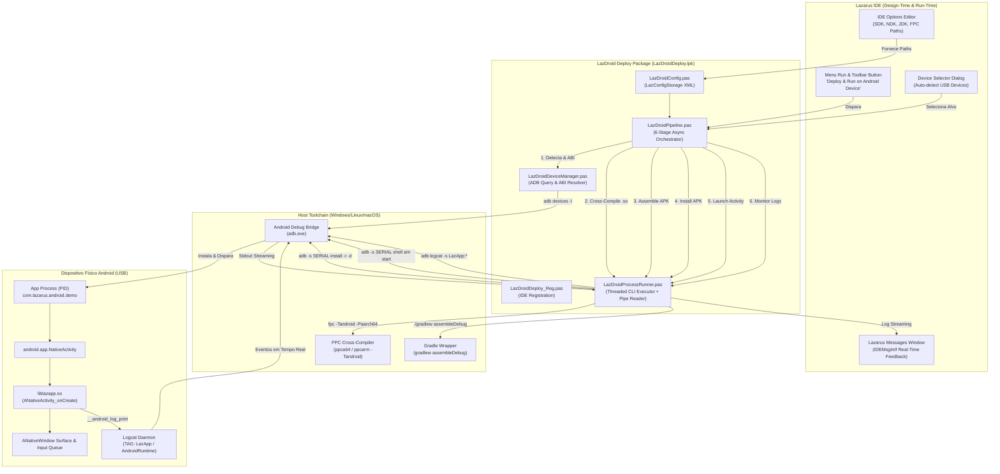
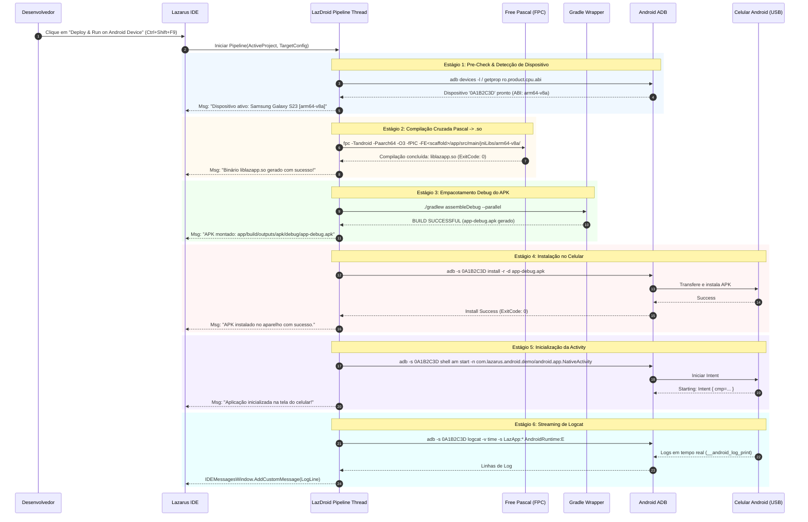

# LazDroid-Deploy — IDE Plugin & Pipeline de Deploy Android para Lazarus

## 1. Visão Geral da Arquitetura

O **LazDroid-Deploy** transforma a experiência de desenvolvimento móvel no Lazarus IDE, proporcionando um ciclo *"Edit & Run (F9)"* idêntico ao do Delphi/Android Studio. Ele orquestra o compilador cruzado Free Pascal (FPC), a injeção em scaffolding Android nativo (`NativeActivity`), o empacotador Gradle e o ADB sobre USB.

---

## 2. Pipeline de Orquestração em 6 Estágios

A esteira de execução implementada em `LazDroidPipeline.pas` opera em background thread não-bloqueante (`TThread` / `TProcess` com pipes assíncronos), emitindo mensagens categorizadas para a IDE:

