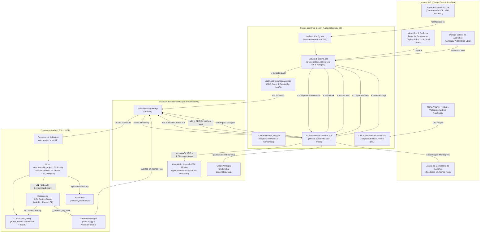
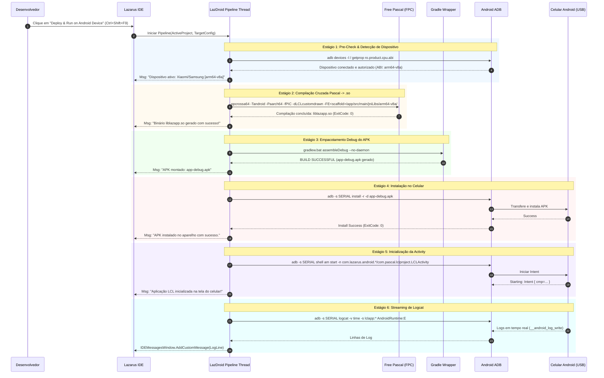

# LazDroid-Deploy — Arquitetura da Solução e Pipeline Android

## 1. Visão Geral da Arquitetura

O **LazDroid-Deploy** transforma a experiência de desenvolvimento móvel no Lazarus IDE, proporcionando um ciclo *"Edit, Design & Run (Ctrl+Shift+F9)"* com formulários visuais reais da **LCL (Lazarus Component Library)**. Ele orquestra o compilador cruzado Free Pascal (FPC), a injeção na camada host Android com suporte a LCL CustomDrawn (`com.pascal.lclproject.LCLActivity`), o empacotador Gradle e o ADB sobre USB.



---

## 2. Pipeline de Orquestração em 6 Estágios

A esteira de execução implementada em [`LazDroidPipeline.pas`](file:///d:/Projetos%20AntiGravity/LazarusAndroid/package/LazDroidPipeline.pas) opera em background thread não-bloqueante (`TThread` / `TProcess` com pipes assíncronos), emitindo mensagens categorizadas para a IDE:



---

## 3. Renderização LCL e Integração JNI

1. **Host Android (`LCLActivity.java`)**:
   - Cria uma subclasse de `View` chamada `LCLSurface`.
   - Gerencia a orientação, resolução e densidade DPI da tela.
   - Fornece um bitmap compartilhado em memória (`Bitmap.Config.ARGB_8888`).
2. **Ponte Pascal (`customdrawn_android.pas` / `customdrawnobject_android.inc`)**:
   - Implementa a função nativa `LCLDrawToBitmap(width, height, bitmap)`.
   - A LCL renderiza toda a árvore de componentes visuais (`TForm`, `TButton`, `TPanel`, etc.) diretamente sobre a superfície do bitmap através do drawer `customdrawndrawers`.
   - Os eventos de toque (`MotionEvent`) são interceptados na classe Java e direcionados via JNI para `LCLOnTouch(x, y, action)`, que mapeia para `MouseDown`, `MouseMove` e `MouseUp` da LCL.

---

## 4. Gerenciador de Alvos Android (Target Manager Estilo Delphi)

Implementado em [`LazDroidTargetDockWin.pas`](file:///d:/Projetos%20AntiGravity/LazarusAndroid/package/LazDroidTargetDockWin.pas), o Gerenciador de Alvos reproduz fielmente o comportamento da árvore **Target** do *Project Manager* do Delphi:

```
▼ 📦 MeuProjeto.lpi
   ▼ 🤖 Android 64-bit (aarch64) - LCL CustomDrawn
      ▼ 🎯 Target
         🟢 Samsung SM-G780G [RQ8R70BFZEJ] (arm64-v8a | Android 13) ★ [ATIVO]
      ▼ ⚙️ Configuration
         ● Debug (GDB Remote & Símbolos)
         ○ Release (Otimizado -O3 -Xs)
      ▼ ⚡ Ações Rápidas
         ▶️ Deploy & Executar (Ctrl+Shift+F9)
         🐞 Deploy & Depurar (Ctrl+F9)
         📋 Abrir Terminal Logcat
         🔄 Atualizar Dispositivos USB
         ⚙️ Opções LazDroid...
```

### Características Técnicas:
1. **Dockable Tool Window (Lazarus Open Tools API)**:
   - Registrado via `IDEWindowCreators.Add('TLazDroidTargetDockForm')`, permitindo ser acoplado com **AnchorDocking** em qualquer quadrante da IDE (por exemplo, abaixo ou ao lado do Project Inspector).
2. **Auto-Polling USB (Plug & Play)**:
   - Um timer não-bloqueante de 2.5s consulta `adb devices -l` de forma transparente. Ao plugar ou desplugar o cabo USB, o nó `Target` atualiza em tempo real sem travar a digitação no editor de código.
3. **Inspeção Completa de Hardware via ADB**:
   - Ao clicar com botão direito -> *Propriedades do Aparelho*, inspeciona dinamicamente: fabricante, modelo comercial, resolução de tela (`wm size`), nível de bateria (`dumpsys battery`), versão do Android e nível da API (SDK).
4. **Deploy Direto sem Interrupções**:
   - Quando um alvo está ativo (`★ [ATIVO]`), o acionamento de `Ctrl+Shift+F9` direciona o deploy diretamente para o aparelho selecionado, eliminando caixas de diálogo repetitivas.

